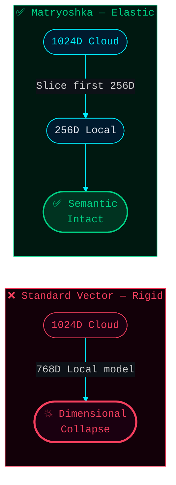
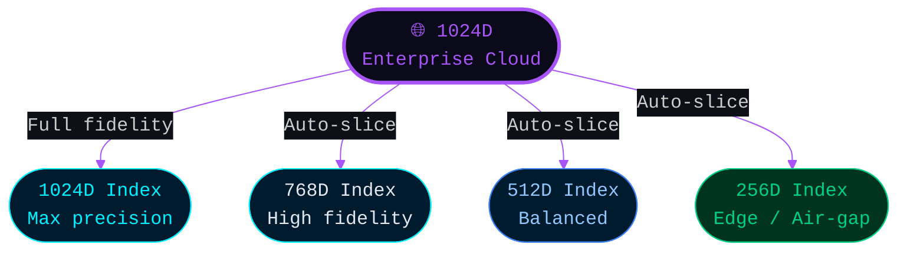
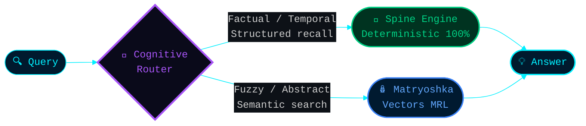

# Chapter III: Future-Proofing with Matryoshka Elasticity

While the **Spine Revelation** proves that Deterministic Ontologies are mandatory for flawless factual, structural, and chronological memory retrieval, vector-based semantic search still holds utility for abstract, "fuzzy" human queries (e.g., *"Find me the note where I felt really inspired by that philosophy concept last spring"*).

To safely integrate mathematical vectors back into the ecosystem without re-triggering the perilous **Dimensional Collapse**, Mnemosyne OS Phase 2 employs advanced **Matryoshka Representation Learning (MRL)**.

## Russian Doll Embeddings
Matryoshka Representation Learning trains embedding models so that critical information is densely packed into the initial dimensions of the vector representation, much like a Russian nesting doll.

### The Elastic Asymmetry Solution
Instead of a rigid 1024D vector breaking when processed by a 768D local model, Matryoshka embeddings act as an elastic band:
- An enterprise node generates a high-fidelity **1024D** vector.
- The user unplugs from the cloud and switches to a local, offline Edge Model supporting only **256D**.
- The Mnemosyne Engine seamlessly slices the first 256 components of the 1024D vector.

Because the vector is a "Matryoshka", the core semantic meaning is mathematically preserved in those first 256 dimensions. No matrices break. No CPU surges to 130%. The performance degradation is negligible, and the system retains extreme agility.

## Strategic Outlook
By combining **Spines (Perfect Deterministic Recall)** with **Matryoshka Vectors (Fluid Semantic Extraction)**, Mnemosyne OS represents the definitive Sovereign Cognitive Architecture.

It is entirely hardware agnostic and features **100% On-Premise Deployment** capabilities. Designed for ultimate security, the ecosystem can operate in fully **Air-gapped environments**, allowing enterprises to physically disconnect their servers from the internet while retaining total AI cognition. Mnemosyne OS is uniquely immunized against the very mathematical vulnerabilities that cripple today's multi-billion-dollar RAG pipelines.
