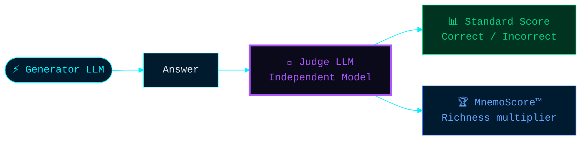

# Chapter V: The Resonance Cascade — A Defense-in-Depth Architecture

The benchmark scores documented in Chapters II and IV are not the result of a single breakthrough algorithm. They are the emergent outcome of a **six-layer defense-in-depth architecture** — where each layer acts as a safety net for the one before it, and where every failure mode has a defined, graceful recovery path.

This is the Resonance Cascade.

> [!IMPORTANT]
> Most AI memory systems are single-layer: one retrieval mechanism, one generation model, one scoring pass. Mnemosyne OS is a **cascading system** — architecturally closer to an immune system than a database. This structural distinction is the primary reason the benchmark results are reproducible and auditable.

---

## The Six Layers

---

### Layer 1 — Cognitive Routing (Ontological Triage)

Before any memory is accessed, a dedicated reasoning model analyzes the user's intent and performs **semantic triage**. The query is routed to the correct domain of memory — not by keyword matching, not by vector proximity, but by genuine categorical reasoning.

**Observable behavior**: The system correctly distinguishes between a question about a person's diet versus a professional code repository, even when phrased ambiguously. It does not retrieve everything and filter down. It selects the right memory space first.

**Why this matters for benchmark accuracy**: A misdirected query wastes retrieval capacity and injects irrelevant context. Triage-first eliminates this class of error at its root.

---

### Layer 2 — Multi-Spine Injection (Deterministic Context Assembly)

Once the memory domain is identified, the Resonance Engine constructs a **structured context block** from multiple independent memory types. Each memory type captures a different dimension of what the user said and when they said it.

The assembled context — the MEMORY CHRONICLES — is injected into the LLM's context window before generation begins.

**Observable behavior**: The LLM receives a rich, pre-structured summary of relevant memory, not a raw semantic similarity dump. It can reason about chronology, identify numbers, trace relationships, and reconstruct narratives — because that structure was built before the LLM was ever called.

**Why this matters**: Standard RAG gives the LLM a pile of loosely related chunks. The Resonance Engine gives it a briefing. The quality of the input determines the ceiling of the output.

---

### Layer 3 — Resonance Delta Check (Coherence Validation)

Before generation, the system evaluates the **internal coherence** of the retrieved memory. If two memory fragments are equally plausible and semantically close — a state we call high Resonance Delta — the system does not silently pick one.

It switches mode.

**Observable behavior**: When the system detects conflicting memories, the LLM's response exhibits genuine, calibrated uncertainty. It names both possibilities, weighs them, and admits it cannot resolve the ambiguity with certainty. This is not a failure — it is a safety-critical feature called **Cognitive Friction**.

**Why this matters**: A system that always produces a confident answer is dangerous. In B2B contexts, a confident wrong answer is worse than an honest doubt. The Resonance Delta Check prevents false certainty from entering the output.

---

### Layer 4 — Governed LLM Generation (Constrained Persona)

Generation is not unconstrained. The LLM operates under strict behavioral parameters: a defined persona, explicit stop sequences, and a bounded output length calibrated to the task type.

**Observable behavior**: The model does not go off-topic. It does not pad responses. It does not adopt a different personality mid-session. Its voice and behavioral constraints are enforced at the prompt engineering layer, not by post-processing.

**Why this matters**: Unconstrained generation is the primary source of fluent hallucinations. By constraining the output *before* it is generated, the system eliminates an entire class of failure before it can occur.

---

### Layer 5 — Independent LLM Judge Cascade (Dual-Model Validation)

Once the primary model generates a response, a **second, independent LLM** evaluates the output against the expected ground truth. The two models never share a context window — the Judge has no access to the same memory the generator used.

The Judge evaluates two distinct dimensions:
1. **Correctness**: Does the answer contain or imply the expected ground truth?
2. **Richness**: Did the system deliver more contextual value than the minimum expected?

This dual evaluation is what produces both the **Standard Accuracy score** and the **MnemoScore™ Over-Delivery metric** simultaneously.

**Why this matters**: Single-model self-evaluation is a known failure mode. A model that generated an answer will tend to find it coherent. Independent evaluation removes this bias structurally.

---

### Layer 6 — Zero-Trust Cognitive Firewall (Abstention Protocol)

The final layer is not about what the system says — it is about what the system *refuses* to say.

When no reliable memory exists for a query, the system does not generate a plausible-sounding answer. It abstains. When injected with contradictory or poisoned context (as demonstrated in the Chaos Engineering benchmark, Chapter IV), it identifies the anomaly and expresses defensive doubt rather than forced compliance.

**Observable behavior**: Answers like *"I see something here that doesn't feel right — I don't want to confirm that without being more certain"* are not failures. They are the Cognitive Firewall activating.

**Why this matters for enterprise**: In regulated industries — finance, healthcare, law — a confident hallucination is a liability. A system that abstains under uncertainty is a compliance asset. The Zero-Trust Cognitive Firewall is what makes Mnemosyne OS structurally auditable: its silence is as meaningful as its answers.

---

## The Emergent Property: Graceful Degradation

What makes this cascade architecturally unique is not any single layer. It is the **composition** — the fact that each layer's failure mode is handled by the next layer down, rather than propagating as a crash or a hallucination.

| Layer Failure | Recovery Mechanism |
|---|---|
| Router misclassifies query | Broader Spine scope compensates |
| Spine data is sparse | Digest summaries provide fallback context |
| Memory is contradictory | Cognitive Friction prevents false confidence |
| Generation drifts | Persona constraints and stop sequences cut it |
| Output is partially wrong | Judge scores partial credit, flags for audit |
| No data at all | Abstention — honest silence over invented answer |

**In every failure scenario, the system degrades gracefully rather than failing catastrophically.** This is the property that allowed the engine to score 79.4% Standard Accuracy under active Dimensional Collapse (0% vector retrieval), and 564.2% MnemoScore under active Chaos Engineering with deliberate hallucination injection.

---

## Local-First as an Architectural Multiplier

All six layers execute **on-premise**, within a native desktop application. This is not a deployment detail — it is an architectural advantage.

- **No network latency** on Spine retrieval — reads are local I/O, not API calls
- **No third-party data exposure** — the MEMORY CHRONICLES never leave the device
- **No vendor lock-in** — the cascade is model-agnostic at every layer
- **User-controlled calibration** — the desktop interface allows real-time adjustment of every layer parameter, creating a closed feedback loop between human intent and system behavior

The combination of a six-layer cascade architecture running entirely on local infrastructure — orchestrated through a native React/Electron interface — places Mnemosyne OS in a category that has no direct equivalent in the current AI memory landscape.

---

## Conclusion

The Resonance Cascade is the answer to the question every enterprise AI evaluator should be asking: *"What happens when it's wrong?"*

In standard RAG systems, the answer is: it hallucinates, confidently.

In Mnemosyne OS, the answer is: it fails gracefully, layer by layer, until it either recovers or abstains — and every step of that process is logged, auditable, and reproducible.

**Resilience is not a feature. It is the architecture.**
