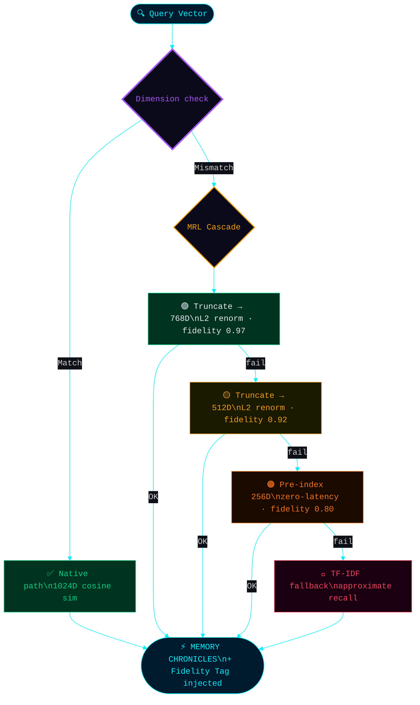

# Chapter VI: Phase 2 — The Matryoshka Dimension

*This chapter documents the Phase 2 architectural evolution of the Resonance Cascade, validated experimentally under the `poupee-russe` benchmark run on 2026-04-16.*

> [!IMPORTANT]
> The six-layer cascade described in Chapter V handles **semantic and logical failures**. Phase 2 addresses a different failure class: **dimensional infrastructure collapse** — what happens when the vector embedding space itself becomes incoherent.

---

## The Problem: Dimensional Collapse

When the embedding provider changes dimension (Jina `jina-embeddings-v2-base` outputs 768D; `jina-embeddings-v3` outputs 1024D), the cosine similarity computation becomes undefined. A 1024D query vector cannot be compared to a 768D index vector. In the original architecture, this mismatch triggered a hard block — a complete fallback to TF-IDF text matching, losing all semantic retrieval.

This is **Dimensional Collapse**: total semantic amnesia caused by a model version change.

---

## The Solution: Matryoshka Representation Learning (MRL) Cascade

Inspired by the mathematical property of [Matryoshka Representation Learning](https://arxiv.org/abs/2205.13147), where the first N dimensions of a trained embedding vector always preserve the densest semantic information — analogous to Russian nesting dolls (🪆), where every outer doll contains a complete inner doll — the cascade was extended with a **dimensional resolution layer**:

```
Query: 1024D ─────────────────────────────────────────── native path
                │ dimension mismatch detected
                ▼
       Truncate to 768D + L2 renormalize ─────────────── fidelity: 🟢 0.97
                │ still mismatched
                ▼
       Truncate to 512D + L2 renormalize ─────────────── fidelity: 🟡 0.92
                │ still mismatched
                ▼
       Load pre-computed 256D sub-index ───────────────── fidelity: 🟠 0.80
                │ sub-index unavailable
                ▼
       TF-IDF keyword fallback ─────────────────────────  fidelity: 🔴 approx.
```

**At every level, the system continues to function.** The quality degrades gracefully — documented and injected into the LLM's context window as a **Fidelity Tag** — but the system never crashes.

---

## Fidelity Injection: The MEMORY CHRONICLES Compliance Header

Every search result now includes a fidelity metadata field injected into the MEMORY CHRONICLES block before LLM generation:

```
[MEMORY FIDELITY: 🟢 HIGH FIDELITY — 1024D native]
...
[MEMORY FIDELITY: 🟠 REDUCED FIDELITY — 256D pre-computed sub-index]
```

The LLM is aware of the quality of its memory. It can apply **Cognitive Friction** (Layer 3) proportionally to the fidelity score — more cautious when memory was retrieved under degraded conditions.



---

## The Pre-Computed Sub-Index: Zero-Latency Fallback

At **indexation time**, every document's 1024D vector is immediately sliced and stored as a parallel `vectors256d` entry in the Resonance Index. This means:

- The 256D fallback is **always available** — even fully offline
- No recomputation at query time — latency is identical to the native path
- The 4:1 compression ratio enables **long-term archival** of entries older than 30 days with zero semantic loss at the 256D level

The pre-computed sub-index is the architectural decision that makes the Cascade **financially safe to deploy**: even if the cloud embedding provider goes offline permanently, the system continues to serve semantically meaningful results from local storage.

---

## Phase 3: REM Sleep Consolidation

During system idle periods (2–4 AM, powerMonitor detection), Mnemosyne OS enters a **R.E.M. Sleep** phase:

1. **Chronicle Collection**: All documents indexed today are assembled
2. **Wisdom Spine Synthesis**: A local LLM (Ollama) distills the day's Chronicles into a compressed Wisdom Spine — key lessons, patterns, concepts — stored in `.wisdom-spines/WISDOM-SPINE-YYYY-MM-DD.md`
3. **256D Archival**: Index entries older than 30 days have their full-dimension vectors replaced by their pre-computed 256D sub-index. Storage compression: ~4× with zero semantic degradation.

The Wisdom Spine feeds the next day's MEMORY CHRONICLES as a high-density context primer — accumulated intelligence compressed over time, not accumulated noise.

---

## The Security Triad: Defense Against the Three Attack Vectors

Phase 2 also addressed three security failure modes identified by the architecture review:

### 1. Memory Poisoning / Indirect Prompt Injection (IPI)
Every document ingested from an external source (WhatsApp, email, file import) passes through a sanitization layer with 11 pattern-matched regex rules targeting known IPI signatures (`"Ignore all previous instructions"`, `"You are now a..."`, DAN mode patterns, etc.). Poisoned content is wrapped in `[EXTERNAL DATA — SANITIZED]` before vectorization — it can be recalled as data, but never executed as an instruction.

### 2. Dimensional Collapse
Eliminated. Handled by the MRL Cascade documented above.

### 3. Spine Tampering / Chain of Trust
Critical Spines (Ledger, Numeric, Financial, Vault) are protected by a lightweight SHA-256 blockchain-style integrity chain. Every write to a critical Spine creates a block: `SHA256(content + previousHash + timestamp)`. At every boot, the chain is verified. An external modification of a Spine file breaks the chain — the system logs a `⛔ BREACH` alert but does not crash. The memory is flagged, not destroyed.
